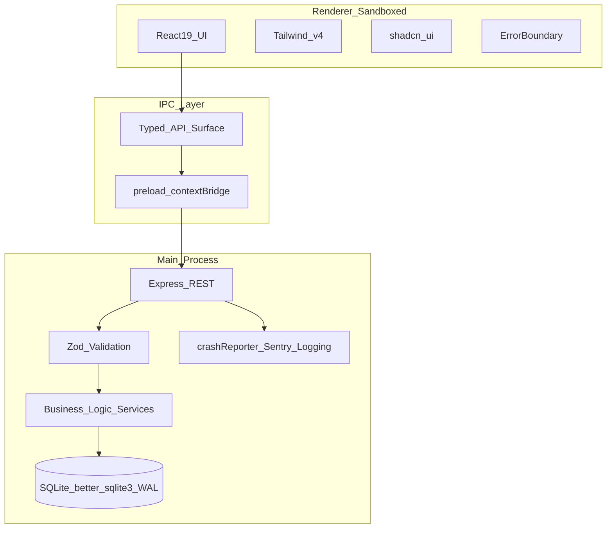
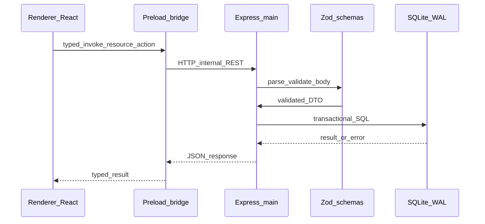
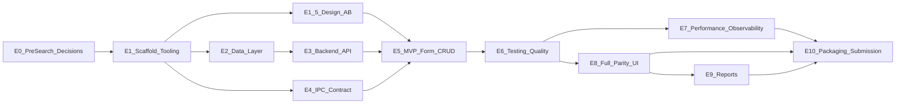

# StarHotel Modernization — Master PRD

**Authority & conflict rule:** [VB6-Hotel-App-Modernization-Project-specs.md](./VB6-Hotel-App-Modernization-Project-specs.md) wins over [StarHotel-Modernization-Design.md](./StarHotel-Modernization-Design.md) when they differ (e.g., observability deadline, required breadth/deliverables). Design doc **B+A** still governs *sequencing*: MVP gate first, then performance budget + polish.

**Resolved gates:** T4, T5, and T2 are recorded in [DECISIONS.md](./DECISIONS.md). Deferred items T1, T3, T6–T8 remain in [TODOS.md](./TODOS.md).

---

## 1. Executive Summary

**Problem statement:** The legacy Star Hotel system (VB6 + Access) is EOL-risky, hard to secure, and STA-limited; the organization needs a production-grade local desktop replacement that preserves operational behavior while meeting a graded sprint rubric.

**Proposed solution:** An Electron desktop app with React 19 + Tailwind v4 + shadcn/ui, strict TypeScript, sandboxed renderer, typed `contextBridge` IPC to an Express server in the **main** process, SQLite via `better-sqlite3` in WAL mode, Zod at boundaries, Vitest + RTL, and Electron Builder packaging—per [CLAUDE.md](../CLAUDE.md) and the course spec.

**Success criteria (measurable KPIs):**

- **MVP gate (~24h):** Secure IPC (`contextIsolation`, no `nodeIntegration`); SQLite WAL + migration runner; Express operational in main; ≥1 legacy form parity in React + Tailwind v4; full CRUD UI → IPC → Express → SQLite; ≥5 Vitest tests on **extracted** business logic; global React error boundary; stable `pnpm dev` / Vite + native module handling; ESLint + Prettier clean.
- **Early submission (~day 4):** Course spec: full UI modernization direction with Tailwind v4 + shadcn; Express routing all local requests; **Sentry + PostHog** integrated (overrides design’s “if time is tight” deferral).
- **Final (~day 7):** Packaged production executable; **feature parity** with legacy where in-scope; submission bundle (README, architecture PDF, demo video, ROI report, OSS contribution proof, social post) per spec.
- **Performance (spec targets):** Cold start ≤2000 ms; critical DB ops ≤50 ms (local WAL); IPC round-trip ≤15 ms (dev-measured harness); primary view transition ≤100 ms perceived; memory discipline toward ≤300 MB under normal use (document methodology).
- **Quality bar:** No raw SQL or DB access from React; Zod on all external inputs; schema-level FK/UNIQUE/NOT NULL where applicable; parity claims backed by tests or an explicit written gap list.

---

## 2. User Experience & Functionality

### **User personas**

- Front-desk staff: fast check-in/out, room status, guest lookup.
- Night audit / back office: reports and reconciliation (scope per T5).
- Evaluator (hotel-tech hiring partner): speed, coherence, architectural credibility.

### **Non-goals (protect timeline)**

- Public guest-facing web booking portal (spec appendix).
- Substituting Tauri/NW.js or non-mandated stack.
- Claiming parity for behaviors neither tested nor explicitly scoped (T5, T4).

### **User stories & acceptance criteria** are folded under **Epics** below (checkbox format).

---

## 3. AI System Requirements

**Not applicable** to core product (no LLM feature in scope). If AI-assisted **development** is used, treat tooling as dev-only: no secrets in repo, no production coupling.

---

## 4. Technical Specifications

### **Architecture overview**

### **End-to-end data flow (CRUD)**

### **Integration points:** Internal REST only (no cloud API required for MVP). Post-MVP: Sentry DSN, PostHog key (env-gated; see T7 in [TODOS.md](./TODOS.md)).

### **Security & privacy:** `contextIsolation: true`, `nodeIntegration: false`; parameterized queries; Zod at HTTP boundary; Argon2 for `tbl_user` passwords ([PRE-SEARCH.md](./PRE-SEARCH.md)); structured logging with PII redaction policy before telemetry (T7).

### **Engineering principles (non-negotiable for implementation)**

- **SOLID:** UI components single-purpose; services/controllers for orchestration; repository or query modules abstract persistence; strategy-friendly pricing/report adapters as scope grows.
- **Modular design:** `packages` or `src/` layers: `domain` (pure logic), `server` (Express, DB), `shared` (Zod schemas/types), `renderer` (UI only).
- **DRY:** Shared Zod schemas between client validation hints and server enforcement; one IPC client wrapper; reuse table/form patterns via composable hooks and UI primitives—not copy-paste screens.

---

## 5. Risks & Roadmap

### **Phased rollout (course checkpoints)**

- **Phase 0 — Pre-search (2h):** Legacy map complete ([PRE-SEARCH.md](./PRE-SEARCH.md)); decisions logged for T4/T5/T2.
- **Phase 1 — MVP (~24h):** Spine: scaffold; optional time-boxed visual exploration / A/B (Epic E1.5) before locking design tokens; DB, Express, IPC, one form, CRUD, tests, lint.
- **Phase 2 — Early submission (~day 4):** Broaden UI; Sentry + PostHog; structured logging; performance budget instrumentation.
- **Phase 3 — Final (~day 7):** Parity gaps closed per scope; reports per T5; packaging; submission artifacts.

**Technical risks:** Native module bundling (`better-sqlite3`); hidden VB6 parity in dates/billing; report complexity (Crystal → PDF/HTML); concurrent access storytelling (WAL + transactions).

---

### **Epic dependency & parallelism**

### **Parallelism (after E1 is green):**

- **E2 (Data)** and **E4 (IPC contract stubs)** can proceed in parallel once repo layout and TS strict baseline exist—coordinate on **shared Zod types**.
- **E1.5 (design A/B)** may run **concurrently** with **E2** and **E4**; coordinate only if shared files (e.g. global CSS tokens) cause merge churn—prefer token experiments in **`style-test/`** or isolated CSS until a decision is written ([STYLE-GUIDE.md](./STYLE-GUIDE.md) is canonical for locked tokens).
- **E6 (tests)** can run in parallel with **E7 (perf/obs)** after **E5** MVP path works (tests target extracted logic first).
- **E8 (broader UI)** and **E7** can overlap if E7 stays behind feature flags/env and does not block CRUD.
- **E9 (reports)** should not start until **T5** resolved; can parallelize with late **E8** only if staffing allows and schema stable.

---

### **Subagent / complementary roles during build**

Use Cursor **Task** subagents (or equivalent) with **narrow prompts** and **readonly** where appropriate:

| Phase | Suggested role focus | Typical subagent |
|-------|----------------------|------------------|
| Discovery / parity | Map legacy forms, schema, edge cases | `explore` (quick/medium) |
| Scaffold & native modules | Shell, Vite externals, pnpm scripts | `shell` / `generalPurpose` |
| Visual / A-B exploration | Design lab routes, token variants, side-by-side comparisons | `generalPurpose` (use **frontend-design** skill when implementing UI) |
| Architecture guardrails | IPC security, layering, transaction boundaries | `generalPurpose` (eng review checklist) |
| Implementation spikes | Vertical slice delivery | `generalPurpose` |
| Test gap analysis | Vitest coverage, parity cases | `generalPurpose` + `explore` |
| CI / packaging | Builder, CI matrix, smoke | `shell` / `ci-watcher` when CI exists |
| Polish & DRY pass | Remove duplication, align patterns | `code-simplifier` |
| Pre-merge risk | SQL injection, IPC exposure, side effects | `generalPurpose` (PR review rubric) |

**Rule:** One subagent = one mission; merge outcomes into the main branch via small PRs/commits to preserve traceability.

---

## Epic roll-up checklist

Do not check an epic until its **Epic DoD** is satisfied (all child user stories checked).

- [x] **E0** — Pre-search, decisions, traceability
- [x] **E1** — Repository scaffold & developer experience
- [x] **E1.5** — Visual design exploration & A/B (static lab + style guide; see [DECISIONS.md](./DECISIONS.md#e15-visual-design-and-style-lab-scope))
- [x] **E2** — Data layer (SQLite, migrations, WAL)
- [ ] **E3** — Backend API (Express in main)
- [ ] **E4** — IPC contract (preload / contextBridge)
- [ ] **E5** — MVP form + full CRUD path
- [ ] **E6** — Testing & quality gates
- [ ] **E7** — Performance budget & observability
- [ ] **E8** — Full parity UI (module breadth per spec)
- [ ] **E9** — Reports (scope per T5)
- [ ] **E10** — Packaging & course submission

---

# Epics, stories, features, subtasks

**How to use:** Do not check a box until its **Definition of Done (DoD)** is satisfied. Parent checkboxes roll up only when all children are checked.

---

## Epic E0 — Pre-search, decisions, traceability

**Epic DoD:** T4/T5/T2 recorded in-repo (e.g., `docs/DECISIONS.md` or spec addendum); PRE-SEARCH checklist marked complete; legacy form/module inventory linked to React route map.

- [x] **US0.1 — Lock migration fork (T4)**  
  - **Feature F0.1.1:** Document clean install vs one-time `.mdb` import.  
    - [x] **T0.1.1.1:** Summarize impact on migrations, seeds, and verification suite (T3).  
    - **DoD:** Written decision + rationale; unblock schema freeze tasks in E2.

- [x] **US0.2 — Report scope contract (T5)**  
  - **Feature F0.2.1:** Define minimum report parity for final submission.  
    - [x] **T0.2.1.1:** Choose receipt/HTML vs grouped financials vs phased list.  
    - **DoD:** Signed scope bullet list referenced by E9.

- [x] **US0.3 — Workflow priority (T2)**  
  - **Feature F0.3.1:** Rank modules for post-MVP expansion.  
    - [x] **T0.3.1.1:** Ordered backlog: e.g., front desk vs night audit vs reports.  
    - **DoD:** Epic E8 user story order reflects this ranking.

---

## Epic E1 — Repository scaffold & developer experience

**Epic DoD:** `pnpm install`, `pnpm dev`, `pnpm build`, `pnpm test`, `pnpm lint`, `pnpm format` exist and are documented in README; strict TS; Electron + Vite stable; Tailwind v4 + shadcn baseline; React **global error boundary** (spec MVP).

- [x] **US1.1 — Electron + Vite + TS strict baseline**  
  - **Feature F1.1.1:** Project scaffold (course: create-electron-vite-style).  
    - [x] **T1.1.1.1:** pnpm workspace / single package layout per team choice.  
    - [x] **T1.1.1.2:** ESLint + Prettier configs; CI-ready scripts.  
    - **DoD:** Clean lint/format; app launches blank shell; cold-start measured and recorded (target ≤2000 ms or gap documented with remediation plan).

- [x] **US1.2 — Tailwind v4 + shadcn/ui**  
  - **Feature F1.2.1:** CSS-first Tailwind v4 per spec.  
    - [x] **T1.2.1.1:** shadcn init compatible with React 19 + Tailwind v4.  
    - [x] **T1.2.1.2:** Design tokens / layout shell for future forms.  
    - **DoD:** Demo view in renderer proves utilities + ≥1 shadcn primitive under Electron; no Rollup errors on CSS pipeline.

- [x] **US1.3 — Global error boundary**  
  - **Feature F1.3.1:** React error boundary (spec MVP).  
    - [x] **T1.3.1.1:** Boundary wraps routed content; fallback UI is accessible and non-crashing.  
    - [x] **T1.3.1.2:** Dev-only throw route or test proves boundary catches render errors.  
    - **DoD:** Documented behavior; manual or automated proof attached to PR notes.

---

## Epic E1.5 — Visual design exploration & A/B

**Epic DoD (project interpretation):** **≥2** distinguishable style directions are available **out-of-band** in the static **`style-test/`** HTML/CSS lab (open in a browser; see README). **In-app** React/Electron design lab is **not** in scope—see [DECISIONS.md — E1.5](./DECISIONS.md#e15-visual-design-and-style-lab-scope). **Decision artifact:** [DECISIONS.md](./DECISIONS.md), [DESIGN-DIRECTION.md](./DESIGN-DIRECTION.md), and [STYLE-GUIDE.md](./STYLE-GUIDE.md) (chosen directions, rejected options, and **token mapping** for E5+). **Production safety:** `style-test/` is not part of the Electron bundle; no extra IPC/backend. **No scope creep:** no duplicated business logic in prototypes.

- [x] **US1.5.1 — Design lab entry (static)**  
  - **Feature F1.5.1.1:** Lab reachable from **`style-test/index.html`** (browser); no requirement for an in-app route.  
    - [x] **T1.5.1.1.1:** Lab is out-of-band static assets (not shipped in the production app bundle).  
    - [x] **T1.5.1.1.2:** README documents how to open the lab (see README § Visual design).  
    - **DoD:** Reviewer can open the lab without running `pnpm dev` or editing source.

- [x] **US1.5.2 — A/B style variants**  
  - **Feature F1.5.2.1:** At least **two** distinguishable directions (**Lakeside Console**, **Night Audit**) in **`style-test/`** HTML/CSS; implementation follows [STYLE-GUIDE.md](./STYLE-GUIDE.md) for React + Tailwind + shadcn.  
    - [x] **T1.5.2.1.1:** `style-test/index.html` links to both variants; comparison without rebuild.  
    - [x] **T1.5.2.1.2:** Variants isolated in separate HTML/CSS files; MVP form code stays untouched until E5.  
    - **DoD:** Stakeholder or team can compare A vs B in one session; rationale captured in DECISIONS + STYLE-GUIDE.

- [x] **US1.5.3 — Lock design direction**  
  - **Feature F1.5.3.1:** Record outcome; tokens applied as E5+ screens land.  
    - [x] **T1.5.3.1.1:** [STYLE-GUIDE.md](./STYLE-GUIDE.md) lists chosen directions, rejected options, and token mapping; [DECISIONS.md](./DECISIONS.md) records scope (including no in-app lab).  
    - [x] **T1.5.3.1.2:** Primary shell / layout from E1.2 updated toward STYLE-GUIDE tokens as part of E5/E8 (STYLE-GUIDE is canonical reference until then).  
    - **DoD:** Appendix table in this document references the decision docs; no undocumented default styles.

---

## Epic E2 — Data layer (SQLite, schema, migrations)

**Epic DoD:** `better-sqlite3` loads in main; WAL enabled; versioned migrations; schema maps legacy tables (`tbl_room`, `tbl_guest`, `tbl_reservation`, `tbl_user`) with PK/FK/NOT NULL as applicable; **no** DB access from renderer; path strategy documented (standalone vs shared drive per future T4 note).

- [x] **US2.1 — Native module & build wiring**  
  - **Feature F2.1.1:** Vite/Electron externals for `better-sqlite3`.  
    - [x] **T2.1.1.1:** Document dev vs prod native resolution.  
    - [x] **T2.1.1.2:** `pnpm build` succeeds with native addon packaged.  
    - **DoD:** Clean production build on at least one target OS; failure modes documented.

- [x] **US2.2 — Migrations & WAL**  
  - **Feature F2.2.1:** Migration runner + `PRAGMA journal_mode=WAL`.  
    - [x] **T2.2.1.1:** Initial DDL from Access mapping ([PRE-SEARCH.md](./PRE-SEARCH.md)).  
    - [x] **T2.2.1.2:** Migration version table or equivalent.  
    - **DoD:** Fresh start creates DB; second launch is idempotent.

- [x] **US2.3 — Integrity constraints**  
  - **Feature F2.3.1:** Overlap / orphan prevention per spec evaluation theme.  
    - [x] **T2.3.1.1:** FKs guest/room → reservation where legacy implies them.  
    - [x] **T2.3.1.2:** Unique/index strategy for “no double booking”: room/date index in E2; **full** overlap-case test matrix in Epic E6 (per evaluation framework).  
    - **DoD:** Constraint violations return structured errors to API layer (not silent corruption).

- [x] **US2.4 — Optional `.mdb` import (N/A — T4 clean install)**  
  - **Skipped per [DECISIONS.md](./DECISIONS.md) (T4):** MVP uses clean install and deterministic seeds only; one-time `.mdb` import is a **post-MVP** option if scheduled.  
  - **Feature F2.4.1:** If T4 = import: one-time migration utility.  
    - [x] **T2.4.1.1:** N/A while import is out of scope; see T4.  
    - **DoD:** If T4 = clean install, mark US skipped with pointer to decision doc.

---

## Epic E3 — Backend API (Express in main)

**Epic DoD:** Express listens only on localhost (or loopback); REST handlers for MVP resource(s); **Zod** validates all request bodies/query params; parameterized SQL only; transactional mutations where multi-step; structured logging hook (winston/electron-log) stub or full per E7.

- [ ] **US3.1 — Server bootstrap in main**  
  - **Feature F3.1.1:** Lifecycle tied to app ready/quit (no zombie servers).  
    - [ ] **T3.1.1.1:** Port selection / conflict handling documented.  
    - **DoD:** Health endpoint or ping returns 200 from main process.

- [ ] **US3.2 — MVP REST resources**  
  - **Feature F3.2.1:** CRUD routes for chosen MVP entity aligned with E5 form.  
    - [ ] **T3.2.1.1:** List + get + create + update + delete (as scope requires).  
    - [ ] **T3.2.1.2:** 4xx/5xx JSON error shape stable and logged.  
    - **DoD:** Postman/curl or automated integration test from main-side.

- [ ] **US3.3 — Domain services (SOLID)**  
  - **Feature F3.3.1:** Extract pricing/totals from legacy `modLogic.bas` into testable pure functions called by services.  
    - [ ] **T3.3.1.1:** No business rules duplicated in route handlers as copy-paste.  
    - **DoD:** Service module unit-tested independently of HTTP (feeds E6).

---

## Epic E4 — IPC contract (preload / contextBridge)

**Epic DoD:** `preload` exposes **minimal** typed API; renderer has zero Node/fs/sqlite access; bridge calls Express via `fetch` or structured HTTP client; types shared from `shared` package/folder (DRY).

- [ ] **US4.1 — Typed bridge surface**  
  - **Feature F4.1.1:** One module defines allowed operations (e.g., `api.reservations.*`).  
    - [ ] **T4.1.1.1:** No `eval`, no arbitrary paths, no shell.  
    - **DoD:** Static review checklist signed; optional security notes in architecture doc.

- [ ] **US4.2 — Renderer API client**  
  - **Feature F4.2.1:** Thin wrapper used by hooks/components.  
    - [ ] **T4.2.1.1:** Maps HTTP errors to user-visible messages via UI patterns (E5/E8).  
    - **DoD:** All data fetching in MVP form goes through this client only.

---

## Epic E5 — MVP form + full CRUD (parity slice)

**Epic DoD:** ≥1 legacy form recreated in React + Tailwind v4; **complete CRUD** from UI through IPC to SQLite; loading / empty / error states (per design B); keyboard-focus basics for shadcn controls.

- [ ] **US5.1 — Form parity**  
  - **Feature F5.1.1:** Chosen form (e.g., Guest, Room, or Reservation per T2) matches legacy fields and labels.  
    - [ ] **T5.1.1.1:** Screenshot or mapping table in `docs/` linking `.frm` → components.  
    - **DoD:** Evaluator can perform create, read, update, delete without developer assistance.

- [ ] **US5.2 — List/detail or grid**  
  - **Feature F5.2.1:** Table pattern (TanStack Table + shadcn) for dense data if applicable.  
    - [ ] **T5.2.1.1:** Pagination or virtualization if row count risks DOM perf.  
    - **DoD:** Interaction remains responsive (align with ≤100 ms view transition goal).

---

## Epic E6 — Testing & quality gates

**Epic DoD:** ≥5 Vitest tests on **extracted** business logic (MVP); RTL coverage on critical MVP component(s); ESLint + Prettier pass in CI or pre-commit; roadmap toward spec evaluation **50-case** matrix documented (happy / edge / concurrency).

- [ ] **US6.1 — Business logic unit tests**  
  - **Feature F6.1.1:** Rate calculation, date boundaries, totals.  
    - [ ] **T6.1.1.1:** Cases: leap years, zero-night edge, partial stay if in legacy.  
    - [ ] **DoD:** ≥5 tests green; each maps to a named legacy behavior or explicit gap.

- [ ] **US6.2 — Component tests**  
  - **Feature F6.2.1:** MVP form validation and submit flow.  
    - [ ] **T6.2.1.1:** Error states asserted with RTL.  
    - **DoD:** `pnpm test` passes in clean checkout.

- [ ] **US6.3 — IPC / integration (stretch)**  
  - **Feature F6.3.1:** Supertest against Express or electron-mock harness.  
    - **DoD:** If not implemented, document reason and substitute with manual test script until E10.

- [ ] **US6.4 — Golden / migration verification (T3, blocked on T4)**  
  - **Feature F6.4.1:** If import path: diff legacy export vs SQLite invariants.  
    - **DoD:** T4 decision = clean slate → mark N/A with rationale.

---

## Epic E7 — Performance budget & observability

**Epic DoD (course spec for Early Submission):** Sentry + PostHog integrated; Electron `crashReporter` (Crashpad) configured; structured backend logging; dev harness or logging for startup, IPC RTT, and critical query latency vs spec thresholds; T7 PII redaction policy applied before wide event capture.

- [ ] **US7.1 — Performance instrumentation**  
  - **Feature F7.1.1:** Timestamps for cold start, IPC ping, representative query.  
    - [ ] **T7.1.1.1:** Results recorded in README or `docs/PERF.md`.  
    - **DoD:** Meets targets or lists gaps + owners.

- [ ] **US7.2 — Sentry (JS + Electron)**  
  - **Feature F7.2.1:** Renderer + main capture; source maps in prod build story documented.  
    - **DoD:** Test event received in Sentry project (staging OK).

- [ ] **US7.3 — PostHog analytics**  
  - **Feature F7.3.1:** Core funnel: session, key navigation, workflow completion.  
    - **DoD:** Test event visible in PostHog; env keys not committed.

- [ ] **US7.4 — crashReporter**  
  - **Feature F7.4.1:** Native crash capture per spec.  
    - **DoD:** Configuration documented in architecture PDF section.

- [ ] **US7.5 — Structured logging**  
  - **Feature F7.5.1:** Request IDs, duration, route, outcome; async where appropriate.  
    - **DoD:** Sample log line in docs; T7 redaction rules referenced.

---

## Epic E8 — Full parity UI (breadth)

**Epic DoD:** Spec “five core functional modules” mapped to shadcn patterns (Input/Label, Data table, Select, DatePicker, Dialog); parity matrix updated; **T1** state matrix doc (loading/empty/error/partial) completed per [TODOS.md](./TODOS.md); hero polish on **one** workflow per design B+A without sacrificing E6/E7 gates.

**Implementation order (per T2):** Build priority follows [DECISIONS.md](./DECISIONS.md) (section **T2**): **US8.5** → **US8.3** → **US8.4** → **US8.2** → **US8.1** → **US8.6** (T1 doc may run in parallel once routes exist). **Epic E9** (reports) follows E8 breadth per dependency graph.

Minimum module mapping (adjust labels to legacy forms); story **IDs** below stay stable—use the order above for sequencing:

- [ ] **US8.1 — Auth / session (`tbl_user`, Argon2)**  
  - **Feature F8.1.1:** Login flow; role surfaced for future authorization.  
    - [ ] **T8.1.1.1:** Password hashing uses Argon2; no plaintext storage.  
    - **DoD:** Legacy weak credentials migrated or reset per T4 decision.

- [ ] **US8.2 — Dashboard / navigation shell**  
  - **Feature F8.2.1:** SPA navigation replacing VB6 hub.  
    - **DoD:** ≤100 ms perceived on route change under typical data volumes or documented.

- [ ] **US8.3 — Rooms management**  
  - **Feature F8.3.1:** CRUD + status consistent with `tbl_room`.  
    - **DoD:** Matches legacy rules or gap list entry.

- [ ] **US8.4 — Guests management**  
  - **Feature F8.4.1:** CRUD + contact fields.  
    - **DoD:** Zod + DB constraints enforced.

- [ ] **US8.5 — Reservations / check-in workflow**  
  - **Feature F8.5.1:** Links guest + room + dates + total.  
    - [ ] **T8.5.1.1:** Uses extracted pricing logic (E3/E6).  
    - **DoD:** Overlap rules covered by tests.

- [ ] **US8.6 — State matrix doc (T1)**  
  - **Feature F8.6.1:** Per-screen L/E/E/partial catalog.  
    - **DoD:** Linked from README; reviewed against UI.

---

## Epic E9 — Reports (Crystal → modern)

**Epic DoD:** Scope per **T5**; output via React print view and/or PDF; data from Express (no renderer SQL); matches agreed parity list.

- [ ] **US9.1 — Report data API**  
  - **Feature F9.1.1:** Queries encapsulated in report service.  
    - **DoD:** Same DRY boundaries as E3.

- [ ] **US9.2 — Guest folio / receipt**  
  - **Feature F9.2.1:** Print-friendly HTML + optional PDF.  
    - **DoD:** Visual parity checklist signed off or gap listed.

- [ ] **US9.3 — Grouped / financial reports (optional per T5)**  
  - **Feature F9.3.1:** Only if T5 includes; else mark N/A.  
    - **DoD:** Explicit reference to [DECISIONS.md](./DECISIONS.md) section **T5** (grouped financials are out of minimum scope unless stretch time is allocated).

---

## Epic E10 — Packaging, CI smoke, submission

**Epic DoD:** Electron Builder (or equivalent) produces installer; **T6** packaging smoke path defined; README complete; 1–2 page architecture **PDF**; 3–5 min demo video; migration **ROI** report; **OSS contribution** artifact; social post draft; public GitHub ready.

- [ ] **US10.1 — Electron Builder**  
  - **Feature F10.1.1:** Targets agreed (e.g., win x64 first).  
    - [ ] **T10.1.1.1:** Native module included in artifact.  
    - **DoD:** Fresh machine install smoke test passed.

- [ ] **US10.2 — CI packaging smoke (T6)**  
  - **Feature F10.2.1:** Workflow builds artifact on tag or main.  
    - **DoD:** Green run recorded; artifacts retained.

- [ ] **US10.3 — Documentation bundle**  
  - **Feature F10.3.1:** README (dev, test, build); architecture PDF with IPC, Zod, perf numbers, test summary.  
    - **DoD:** PDF linked from README.

- [ ] **US10.4 — Demo video & narrative**  
  - **Feature F10.4.1:** Legacy vs modern split screen per spec.  
    - **DoD:** Video linked from README.

- [ ] **US10.5 — ROI & OSS contribution**  
  - **Feature F10.5.1:** Cost analysis doc; OSS artifact URL (tooling, template, or blog).  
    - **DoD:** Links in README.

- [ ] **US10.6 — Social post**  
  - **Feature F10.6.1:** One technical hurdle story.  
    - **DoD:** Draft in `docs/` or linked.

---

## Appendix — Spec cross-reference

| Topic | Source |
|-------|--------|
| MVP gate checklist | [VB6-Hotel-App-Modernization-Project-specs.md](./VB6-Hotel-App-Modernization-Project-specs.md) §MVP Requirements |
| Build strategy order | Same, §Build Strategy |
| Performance table | Same, §Performance Targets |
| Evaluation / 50 cases | Same, §Evaluation Framework |
| Submission list | Same, §Submission Requirements |
| Sequencing B+A | [StarHotel-Modernization-Design.md](./StarHotel-Modernization-Design.md) |
| Legacy schema & logic | [PRE-SEARCH.md](./PRE-SEARCH.md) |
| Deferred items (T1, T3, T6–T8); resolved T2/T4/T5 | [TODOS.md](./TODOS.md) + [DECISIONS.md](./DECISIONS.md) |
| Visual A/B & locked tokens (E1.5) | [DECISIONS.md](./DECISIONS.md#e15-visual-design-and-style-lab-scope), [DESIGN-DIRECTION.md](./DESIGN-DIRECTION.md), [STYLE-GUIDE.md](./STYLE-GUIDE.md), [style-test/](../style-test/) |
| Stack & commands | [CLAUDE.md](../CLAUDE.md) |

---

*This document implements the StarHotel Master PRD plan; the plan file in `.cursor/plans/` is the upstream outline and must not be edited for content drift—update this file instead.*
